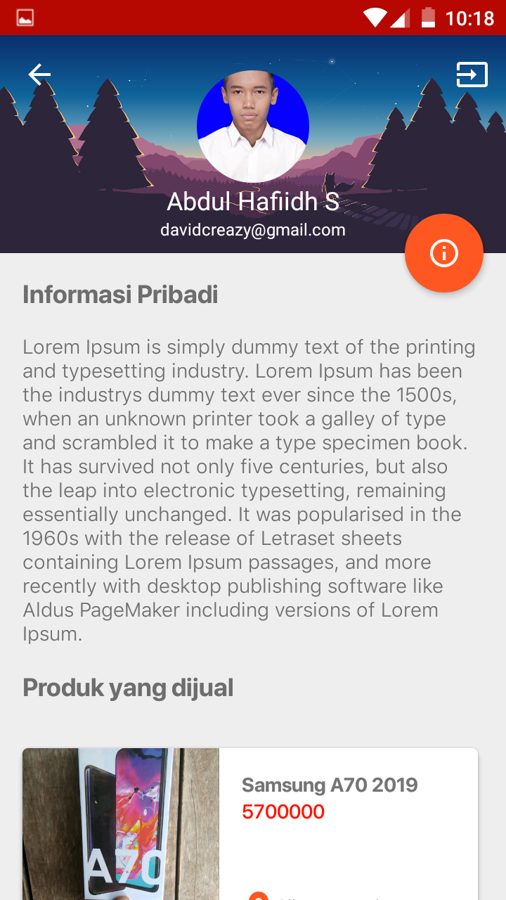

  <a href="#">
    
		<h1 align="center">OrataShop</h1>
  </a>

  OrataShop adalah Sample E-Commerce Android App yang di build menggunakan Kotlin, Tujuannya aplikasi ini di buat adalah untuk pembelajaran semata

Aplikasi ini di buat oleh mahasiswa semester akhir D2 Program Studi Teknik Informatika Politeknik Negeri Bandung.

 

Tampilan HomeScreen.

Tampilan About.

Tampilan Detail.

